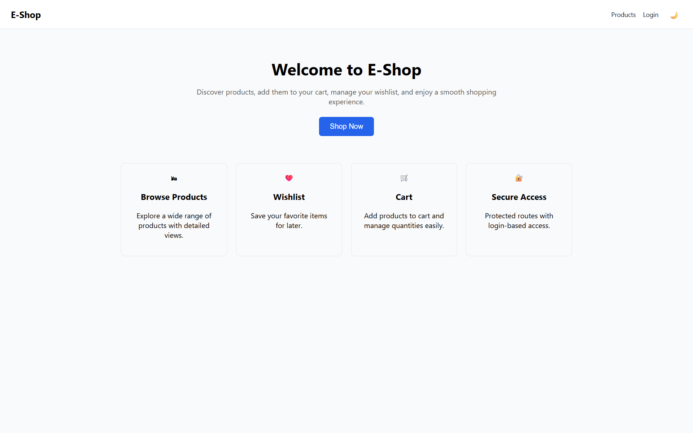
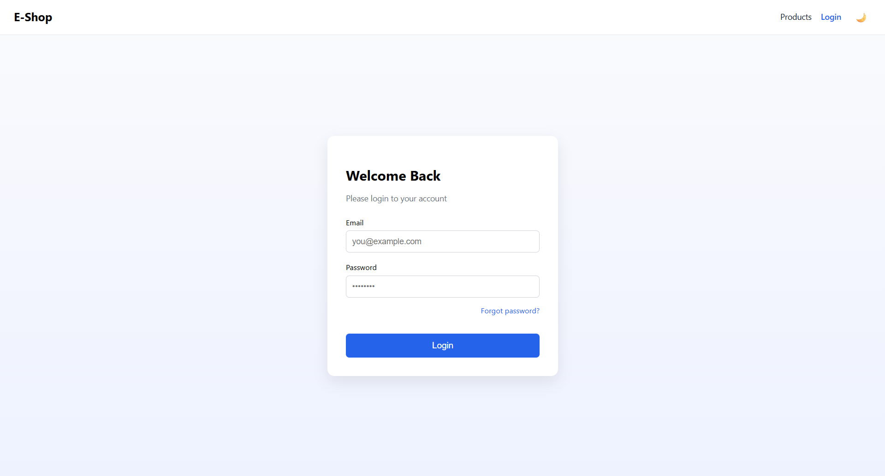

E-COMMERCE FRONTEND APPLICATION

🔗 Live Demo: https://ecommerce-frontend-beryl-two.vercel.app/

A modern e-commerce frontend application built with React, featuring
auth-protected routes, cart and wishlist management, dark mode,
and a fully responsive UI.

This project focuses on real-world frontend architecture,
UX patterns, and state management without relying on a backend.

FEATURES

- Home Page
  - Hero section with call-to-action
  - Feature highlights (Browse, Wishlist, Cart, Secure Access)
  - Entry point to the shopping flow

- Authentication flow (mocked)
- Protected routes (Cart & Wishlist)
- Product listing using API data
- Product details page
- Add to cart with visual feedback
- Wishlist functionality
- Light / Dark mode toggle
- Fully responsive (mobile-first)
- Animated mobile navigation menu
- Toast notifications for user feedback
- Redirect to intended page after login

TECH STACK

- React
- React Router DOM
- Context API
- react-hot-toast
- CSS (Flexbox & Media Queries)
- Fake Store API

AUTHENTICATION FLOW

- Authentication is mocked using AuthContext
- Protected routes redirect unauthenticated users to Login
- After login, users are redirected back to the intended page
- Login state persists using localStorage

NOTE:
This project is frontend-focused and does not use real backend authentication.

## 📸 Screenshots

All UI screenshots are available in the "screenshots" folder, including:

### Home page

### Products page (Light & Dark mode)

### Product details page

### Cart page

### Wishlist page

### Login page

### Mobile navigation view

PROJECT STRUCTURE

src/
  components/
    Navbar.jsx
    ProtectedRoute.jsx
  context/
    AuthContext.jsx
    CartContext.jsx
    WishlistContext.jsx
    ThemeContext.jsx
  pages/
    Home.jsx
    Products.jsx
    ProductDetails.jsx
    Cart.jsx
    Wishlist.jsx
    Login.jsx
  App.jsx
  main.jsx

GETTING STARTED

1. Clone the repository

   git clone https://github.com/negibharat8256/ecommerce-frontend.git

2. Install dependencies

   npm install

3. Start the development server

   npm run dev

AUTHOR

Bharat Negi
Frontend Developer